# Predicting Video game Playtime

---

# Introduction

### Dataset

For this project, I used two of the Steam video game datasets available in Professor Julian McAuley's Recommender Systems and Personalization Datasets Repository (link to access datasets [here](https://cseweb.ucsd.edu/~jmcauley/datasets.html#steam_data)). 

The first data set is "australian_users_items.json.gz" which contains information on various Steam users as well as which games they own and which they have played. The second dataset is "steam_games.json.gz" which contains information on various games available on Steam, such as the price, genre, an release date. The relevant column breakdowns are as follows:

```
User Data (australian_users_items.json.gz)
|--- steam_id: The unique number which identifies a Steam account
|--- items: A dictionary of items owned by the user
|      | item_id: The id of an item owned by the user
|      | playtime_forever: The user's total playtime for item_id
|      | playtime_2weeks: The user's total playtime for item_id within the last 2 weeks
```

```
Item Data (steam_games.json.gz)
|--- id: The unique number which identifies a Steam application
|--- Genres: A list of genres attached to the item
|--- Tags: A list of general descriptors for a item
|--- Specs: A list of specifications/features offered for an item
```


---

# Exploratory Data Analysis

## User Data

The base user dataset has 88,310 rows with no missing values. Each user row contains a list of items that the user interacted with - these items consist mainly of video games, though there are other forms of media available as well, such as video/audio production tools. For each item, the number of hours played total and the number of hours played within the last two weeks are provided. 

After processing, the base user-item interaction dataset extracted from the base user dataset has over 5 million rows of data, so in order to reduce the computational needs for certain algorithms, a few actions were taken. First, a random sample of 20,000 users were extracted from the user dataset. Then, after extracting the interaction data, a random sample of 850,000 interactions were extracted. The dataset was then further reduced to exclude users with fewer than 3 interactions or have 0 total playtime - since the ultimate task is to predict a user's playtime for a given game, these users would not have enough data to create meaningful predictions. Additionally, all duplicate interactions were removed from the dataset.

After filtering, the resulting dataset contains 846,137 interactions across 13,188 users and 9,161 items.

#### Owning vs Playing

Most users in this reduced dataset own many games, with the mean at 58 games and the median at 33 games, even after limiting the number of interactions. The maximum number of games owned is extremely high at 5588 games, and there are 1028 users who own enough games to be high outliers. The distribution of the number of games owned per user is highly right-skewed, with 75% of the users owning fewer than 68 games. When limiting the analysis to only games that each user has played, the numbers are much lower - the mean number of games played is 37, with the median at 23, and the distribution is slightly less right-skewed.

Most games in this dataset have many owners, as the mean number of owners is 87. However, the distribution is significantly more right-skewed with the median number of owners at 12, and with 75% of all games having fewer than 47. Additionally, there are 1394 high outliers, with the maximum number of users at 7423. When limiting the analysis to only owners who have actually played each game, the numbers are also generally lower - the mean number of players is 67, with the median at 7. Unlike the user distribution though, the distribution of players vs owners is fairly similar.

<br>
<center>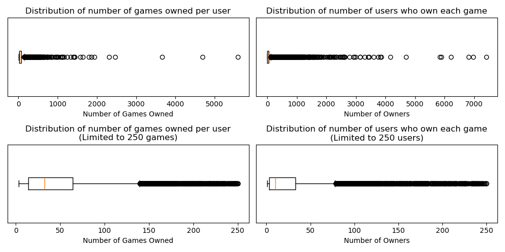</center>

<br>
<center>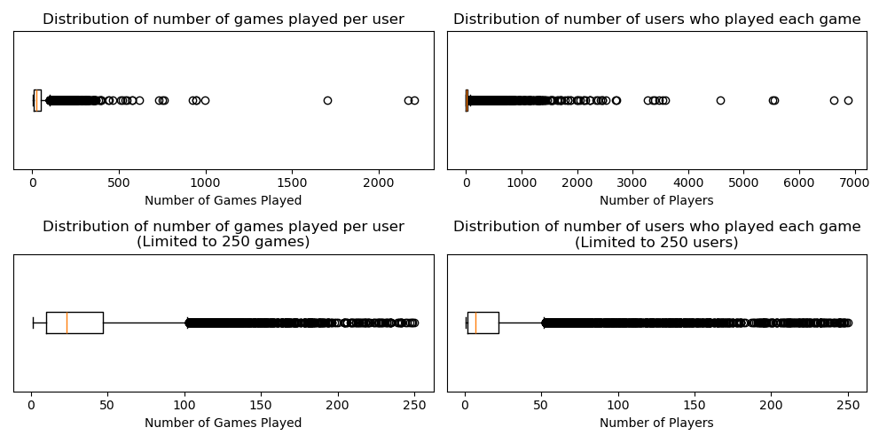</center>

#### Visualizing Hours Played

The distribution of hours played appears to be bimodal - across all interactions recorded, most users either have not played a game that they own, or they have played a game for fewer than about 5 hours. However, there is a notable second peak at about 313 hours of playtime (This corresponds to about 5.5-5.75 on the log playtime axis).

<br>
<center>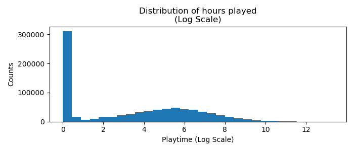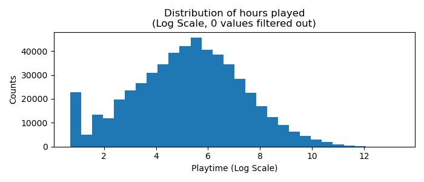</center>

In this dataset, 535,009 games have been played by the user (63.22%) , while 311,128 games have not been played by the user (36.77%).

<br>
<center>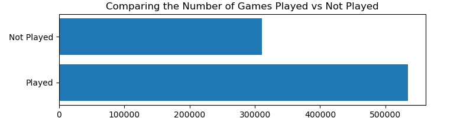</center>

## Item Data

The game dataset has 32,135 rows and 15 different features. Each feature column has missing values, including the id column. There was a single duplicate entry which was removed from the dataset along with the entry missing an id. After filtering out all games that are not represented in the playtime dataset, there are 8223 games remaining.

#### Exploring the Categorical Features

There are three categorical features which cluster the items together to various degrees: Specs, Tags, and Genres. Out of the entire dataset, there are only 21 genres and 39 spec values, but there are 337 tags. 

<br>
<center>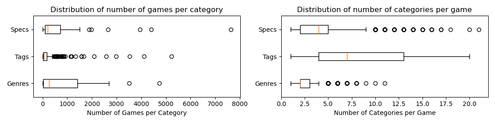</center>

The genre category has the widest distribution of games per category and the tightest distribution of categories per game. It also has the fewest number of values, making this feature likely the most useful item feature for predictions.

<br>
<center>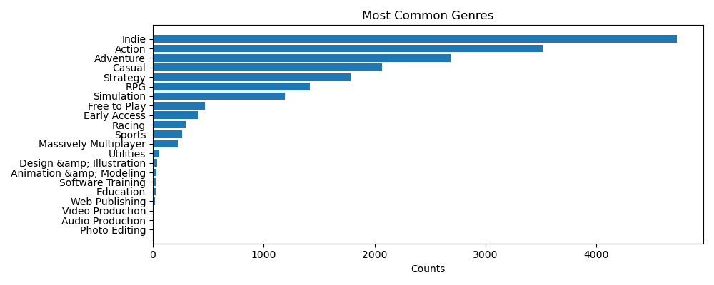</center>

On the other hand, the tags category has a very different distribution - each tag applies to fewer games while each game has relatively many tags attached to them. Another very interesting thing to note is that the most common tags actually have a lot of overlap with the most common genres. While I don't believe this feature will be a great predictor due to its distribution, it will be interesting to confirm if that is indeed the case.

<br>
<center>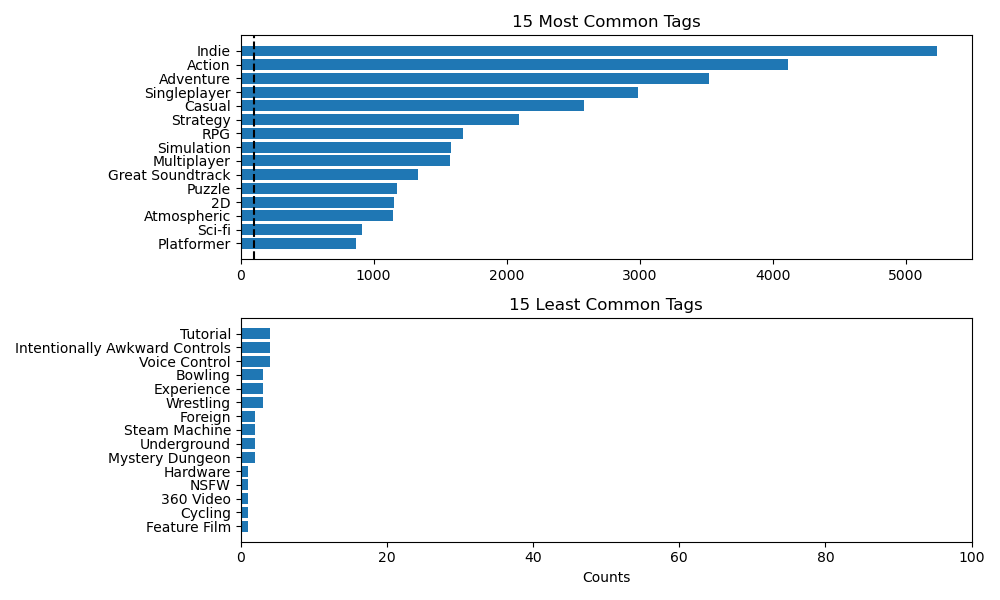</center>

# Task: Predict how many hours a player will spend playing a game based on historical interactions

#### Business Case

Although many of the users in this dataset own hundreds of games, many of these games have actually not been played. By accurately predicting how long a given user will play a specific game, one can build a personalized recommendation system that can present a selection of games that is catered to a specific user's taste based on their typical playstyle. These recommendations can be for games not currently owned by the user, or they can be for games owned by the user but which have not yet been played. The first system would be more typical of a recommender system which identifies new games to play, while the second system would help encourage users to play games they already own.


### Required Data Preprocessing

First, all user features except the steam_id and items were dropped. The steam_ids were then anonymized via a hash function to protect sensitive user information. The items for each user are contained within a dictionary which needed to be extracted. For each user, each item was extracted and added to a separate dataframe along with the corresponding playtime_forever value. To aid with further analysis, additional features based on playtime were engineered. All users with either 0 total playtime or with fewer than 3 games were removed from the dataset as these users did not have enough interaction data to make meaningful predictions for this task.

All models will mainly use the playtime_log variable as the predictor, though the original playtime feature is retained for reference.

```
| Playtime DataFrame (846,137 rows)

|ID Features
|--- user_id: Anonymized user identifier
|--- item_id: An item which was interacted with by user_id

|Class Features
|--- playtime: The amount of time that user_id played item_id (in hours)
|--- playtime_log: The output of log(playtime + 1) to help account for extreme scale of playtime
```

This dataframe would then be further split into a training and validation set (for hyperparameter tuning), as well as a secondary training2 and test set (for evaluating the resulting models).

A few models required extra columns and/or data frames not used by the others. These are detailed below:

```
|Baseline
|--- playtime_scaled: The playtime feature scaled to its min/max values
|--- playtime_log_scaled: The platyime_log feature scaled to its min/max values

|Factorization Machine
|--- N genre columns: A set of N OHE columns corresponding to whether or not the item had a certain genre attached to it
|------ Additionally, an extra "Other" column is added to represent all other genres
|--- N tag columns: A set of N OHE columns corresponding to whether or not the item had a certain tag attached to it
|------ Additionally, an extra "Other" column is added to represent all other tags
```

To create the OHE genre/tag columns, each user and item received a weight corresponding to some calculated value. For each item and each user, the weights are normalized to sum to 1.0

The item weights were calculated according to how many genres applied to each item. For example, if an item was Action, Indie, Adventure, and Casual, and only Action and Indie were the genres used, then the item would get a 0.25 weight for Action, a 0.25 weight for Indie, and a 0.5 weight for Other. If an item did not have an Action or Indie tag, then it would receive a 1.0 weight for Other.

The user weights were calculated as the number of hours played (per category) divided by the number of games played (per category)

### Creating recommendation data structures to implement models

As most users and items have not interacted, dense representations would be extremely inefficient. Thus, certain data structures are necessary in order to implement scalable models as they help create sparse representations of the interaction data. The values are all extracted using the train/train2 datasets only, and these values are used to infer predictions on the valid/test sets. These structures are detailed below

```
Keys:
u_id --> User ID
i_id --> Item ID
h --> Hours played (on log scale)

|itemsPerUser: A dictionary containing (i_id, h) pairs for each interaction by u_id in the training set
|usersPerItem: A dictionary containing (u_id, h) pairs for each interaction by i_id in the training set
|valueDict: A dictionary containing (h) values for each (u_id, i_id) interaction in the training set
|userAverages: A dictionary containing the mean (h) value for each u_id in the training set
|itemAverages: A dictionary containing the mean (h) value for each i_id in the training set
|meanValue: The mean (h) value across the training set
```

### Model Outline

I will test a variety of models to determine which ones the most effective for this task. These models increase in complexity, and in theory, these added complexities should result in a more accurate model. The specific implementations are further discussed within each model section:

* <b>Baseline: Predicting the Mean and Median Value</b>
* <b>Memory-Based Collaborative Filtering</b>
* <b>Latent Factor Model</b> 
* <b>Factorization Machine with Genre Data</b>
* <b>Factorization Machine with Tags Data</b>

For each model, the output predictions will be restricted with a lower bound of 0 to prevent negative playtime predictions.

### Evaluating the models

To evaluate each model, I will compare the MSEs and MAEs of the predictions to the log-scaled playtime values across the dataset. I will also compare the MSEs and MAEs of each prediction for different groupings of users and items based on the number of games owned/played. This secondary analysis indicates how well each model performs when predicting playtime for users or items with fewer interactions.

I will also compare the time required to build the models and to infer predictions on new data, as, depending on the situation, an incredibly accurate model with a high training time may not be as useful, or at least not as scalable, as an okay model which can be quickly developed and implemented.

### Related Literature

This dataset of steam games and user information was sourced from Professor McAuley's data repository - there are three papers noted in the repository which studied this dataset. However, each focus on item/bundle recommendations specifically, rather than playtime prediction.:

* **Self-Attentive Sequential Recommendation**
  * Wang-Cheng Kang, Julian McAuley
  * Here, the authors aim to capture a notion of "context" based on a user's recent actions via Markov Chains, Recurrent Neural Networks, and Self-Attention based Sequential Models. With this context, items relevant to the user's recent history can be recommended more effectively.
* **Item Recommendation on Monotonic Behavior Chains**
  * Mengting Wan, Julian McAuley
  * Here, the authors combine implicit and explicit user data to model user-item interactions. They also study different levels of explicit/implicit interactions, and how they are connected in chains (such as click-->purchase-->review)
* **Generating and Personalizing Bundle Recommendations on Steam**
  * Apurva Pathak, Kshitiz Gupta, Julian McAuley
  * Here, the authors aim to formulate methods that allow for bundled item recommendations, including how to define a bundle, how to rank possible bundle options, and how to ultimately generate the bundles.
 
The task of predicting a value based on interaction data is not particularly new, and there are several state-of-the-art techniques, including the ones that I have included in this analysis. Some examples of other methods not utilized here are deep learning methods such as CNNs and RNNs. 

* **Factorization Machines**
  * Steffen Rendle
  * Introduces the idea of a factorization machine which can incorporate both interaction data as well as other general features. It proves that FMs are highly scalable and compares their results to other factorization methods such as SVD++ and Factorized Personalized Markov Chains. Most notably, it provides a simplification to the dot-product summation term which greatly reduces the amount of computations required for implmentation.
* **AutoRec: Autoencoders Meet Collaborative Filtering**
  * Suvash Sedhain, Aditya Krishna Menon, Scott Sanner, Lexing Xie
  * Here, the idea of using AutoRec as a collaborative filtering model is introduced for a compact and efficient representation of user-item interactions. The authors tested this model on the Movielens and Netflix datasets and found that AutoRec consistent outperformed all baseline methods tested, including various matrix factorization models. Additionally, the resulting model is quite compact, with good results stemming from even just few hidden layers.
 
See the citations section for the full citation for every paper listed here.

---

# Results

### Model 1: Baseline: Predicting the Mean Value

The simplest model to predict the playtime value while minimizing the MSE is one which simply predicts the mean value of the dataset. Similarly, if one wanted to minimize the MAE instead, the simplest model would be one which simply predicts the median value. This dataset has a large number of extreme outliers both in terms of hours played as well as in terms of the number of games owned/played, so using playtime directly may lead to more unstable outputs. To verify this, I tested the baseline performance when predicting the mean/median on the regular playtime scale as well as the log-transformed playtime scale. In order to compare the performances, I scaled each output appropriately between the log-transforms.

All models were trained and predictions were inferred within about 0.17s collectively with the results tabulated below:

|Model|Prediction Value|MSE (Playtime)|MSE (Log Playtime)|MAE (Playtime)|MAE (Log Playtime)|
|-|-|-|-|-|-|
|Mean Playtime      |974.63 |26979453.889|21.94|1446.52|3.894|
|Mean Log Playtime  |3.32   |27833218.881|9.19 |947.33 |2.727|
|Median Playtime    |33     |27822684.146|9.22 |947.24 |2.714|
|Median Log Playtime|3.53   |27822684.146|9.22 |947.24 |2.714|

As expected, using the mean on the regular playtime scale resulted in fairly significant devations in both MSE and MAE, while using the median on the regular playtime scale was quite stable. Since both the mean and median of the log-transformed scale resulted in very similar performance, the log playtime variable will be the main focus for subsequent models. 

### Model 2: Memory-Based Collaborative Filtering

Memory-based collaborative filtering are a class of recommender system techniques which estimate some query interaction based on similarity measures calculated using past user-item interactions. For example, one could estimate how user A will rate movie B based on how user A rated movies similar to movie B. To implement this style of recommender system, one needs to provide a similarity metric as well as some kind of framework as to how the similarity metric will be used to generate predictions.

First, statistics were extracted from the training data and stored in the aforementioned recommendation data structures. Then, the number of hours played given a query interaction was estimated based on some similarity measure between the query user and query item. 

Specifically, when the similarity is based on users, the calculation is then based on the similarity between the query user and other users who interacted with the query item. Likewise, when the similarity is based on items, then the calculation is based on the similarity between the query item and other items interacted with by the query user. However, many users and items have thousands of interactions each, so in order to reduce the computational overhead for this task, the similarity between users was limited to 151 random item interactions, while the similarity between items was limited to 115 random user interactions. These values are statistical cutoffs calculated via the IQR method ($1.5*IQR + Q3$) where values above the cutoff are likely outliers.

The equation used to implement this task is below - this variation estimates the rating that user u will give to user i based on a weighted combination of how the user rated similar items. This implementation focuses on how much the user's rating deviates from the average rating that the item receives to get a better sense of how much the user "likes" the similar item compared to others. Similarly, the final prediction is referenced from the user's mean to get a better sense of how much the user "likes" the query item compared to other items that the user has interacted with.

$\huge r(u,i) = \bar{R_u} + \frac{\sum_{j \in I_u \textbackslash \{i\}} (R_{u,j} - \bar{R_j}) \cdot Sim(i,j)} {\sum_{j \in I_u \textbackslash \{i\}} Sim(i,j)}$

To achieve this, various similarity functions (with example implementations) and configurations were tested with the results tabulated below. 

**Jaccard Similarity**: Between set A and set B

$\large s(A,B) = \frac{|A \cap B|}{|A \cup B|}$

**Cosine Similiarity (Binary)** Between set A and set B

$\large s(A,B) = \frac{|A \cap B|}{\sqrt{|A||B|}}$

**Cosine Similarity**: Between user u and user v

$\huge Sim(u,v) = \frac{\sum_{i \in I_u \cap I_v}(R_{u,i} R_{v,i})}{\sqrt{\sum_{i \in I_u \cap I_v}(R_{u,i})^{2}\sum_{i \in I_u \cap I_v}(R_{v,i})^{2}}}$

**Pearson Similarity**: Between user u and user v

$\huge Sim(u,v) = \frac{\sum_{i \in I_u \cap I_v}(R_{u,i} - \bar{R_u})(R_{v,i} - \bar{R_v})}{\sqrt{\sum_{i \in I_u \cap I_v}(R_{u,i} - \bar{R_u})^{2}\sum_{i \in I_u \cap I_v}(R_{v,i} - \bar{R_v})^{2}}}$

<br>

The similarity data is extracted from the combined training/validation set, and the resulting model is used to infer predictions on the test set. Each model had a lower bound on the outputs of 0, and as the Pearson models had extremely high error rates, an additional upper bound was applied to those models. This upper bound was the maximum log-playtime value encountered in the training data set. The training time is set as the time required to develop the recommendation data structures, while the prediction time is the time required to process all query interactions.

|Similarity Function|Similarity based on|Test MSE|Test MAE|Training Time(s)|Prediction Time(s)|
|-|-|-|-|-|-|
|Jaccard                |User|4.9636|1.7104|1.07|217.265|
|Jaccard                |Item|4.9369|1.7109|1.07|338.105|
|Cosine Binary          |User|4.9549|1.7111|1.07|192.607|
|Cosine Binary          |Item|4.9384|1.7117|1.07|319.863|
|Cosine                 |User|5.9687|1.9061|1.07|834.253|
|Cosine                 |Item|5.0192|1.9061|1.07|962.648|
|Pearson                |User|5.9687|1.9061|1.07|1016.332|
|Pearson                |Item|5.9687|1.9061|1.07|1044.716|
|Pearson (Upper Bounded)|User|5.9687|1.9061|1.07|-|
|Pearson (Upper Bounded)|Item|5.9687|1.9061|1.07|-|

### Model 3: Latent Factor Model (LFM)

The latent factor model aims to summarize user and item interactions using latent factors. Essentially, instead of using a dense matrix representation of user-item interactions, the LFM uses separate user and item latent vectors which allows for the modeling of complex interactions via a dot product.

First, statistics were extracted from the training data and stored in the aforementioned recommendation data structures. Then, the interaction data was inputted into a custom latent factor model that utilizes the following objective function:

$$
L(u,i) =
\sum_{(u,i) \epsilon T}[(\alpha + \beta_{i} + \beta_{u} + \gamma_i \cdot \gamma_u) - R(u,i)]^2
+
\lambda_{\beta}
\begin{bmatrix}
\sum_{u=1}^{|U|}\beta_{u}^{2} 
+ 
\sum_{i=1}^{|I|}\beta_{i}^{2}
\end{bmatrix}
+
\lambda_{\gamma}
\begin{bmatrix}
\sum_{u=1}^{|U|}\sum_{k=1}^{|K|}\gamma_{u}^{2} 
+
\sum_{i=1}^{|I|}\sum_{k=1}^{|K|}\gamma_{i}^{2}
\end{bmatrix}
$$

where $T$ refers to the dataset, $u$ is the query user, $i$ is the query item, and $R(u,i)$ is the target value.

To minimize this loss function, I implemented a coordinate descent algorithm which follows an alternating least squares methodology:

1. Update Alpha
2. Update all Bias terms
3. Update Gamma, then mark the next gamma to be updated
4. Repeat this cycle until the model converges

The following equations determine what the updated parameter should be (shown for alpha, user bias, and user gamma)

$$
\alpha = 
\frac{1}{|T|} \sum_{(u,i) \epsilon T}
[
R(u,i) -  (\beta_{i} + \beta_{u} + \gamma_i \cdot \gamma_u)
]
$$

$$
\beta_{u} = 
\frac{1}{|I_u| + \lambda_{\beta}} \sum_{i \epsilon I_u}
[
R(u,i) -  (\alpha + \beta_{i} + \gamma_i \cdot \gamma_u)
]
$$

$$
\gamma_{u,k} = 
\frac{1}{|I_u|\sum_{i \epsilon I_u}\gamma_{i,k}^{2} + \lambda_{\beta}} \sum_{i \epsilon I_u}
[
R(u,i) -  (\alpha + \beta_{i} + \beta_{u})
]
\gamma_{i,k}
$$

I performed a grid search to find the best parameters, then reinitialized the dataset using the combined training/validation set and the best parameters to infer predictions on the test set.

<br>
<center>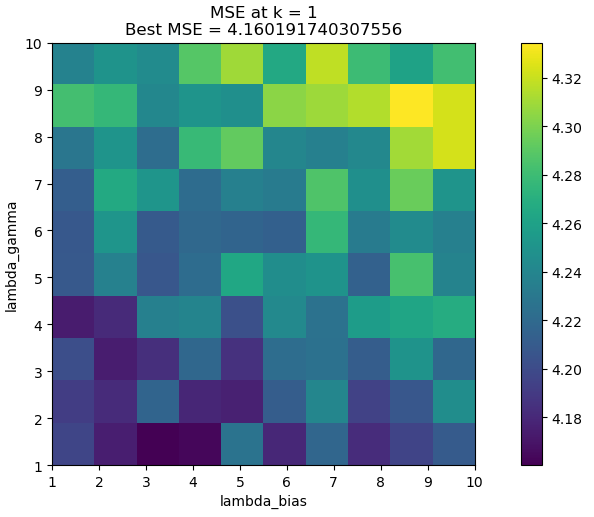</center>

**Best Model**:

```
k = 1
lambda_bias = 0
lambda_gamma = 0.6667
```

|Test MSE|Test MAE|Training Time|Prediction Time|
|-|-|-|-|
|4.25651|1.57026|200.28151|0.33000|


### Model 4: Factorization Machine (FM) with Genre Data

The factorization machine is a generalization of the latent factor model which allows for the inclusion of non-interaction features, something which the regular latent factor model does not support.

First, statistics were extracted from the training data and stored in the aforementioned recommendation data structures. Then, the interaction data was inputted into a custom factorization machine model that utilizes the following objective function. Note that it is the same as the latent factor objective but with added beta/gamma features corresponding to each OHE genre feature which was added to the model.

With $n$ representing the number of features being modeled, $k$ representing the length of the latent vectors, and $i$/$j$ representing two separate instances of a feature:

$$
L(x) =
\sum_{x \epsilon T}
[(\alpha + \sum_{i=1}^{n}\beta_{i}x_{i} + 
\sum_{i=1}^{n}\sum_{j=i+1}^{n}<\gamma_i,\gamma_j>x_{i}x_{j}) - 
R(x)]^2
+
\lambda_{\beta}
\begin{bmatrix}
\sum_{i=1}^{n}\beta_{i}^{2} 
\end{bmatrix}
+
\lambda_{\gamma}
\begin{bmatrix}
\sum_{i=1}^{n}\sum_{k=1}^{k}\gamma_{i}^{2} 
\end{bmatrix}
$$

In this notation, the dot products representing feature interactions involve many calculations, leading to $O(kn^2)$ computation complexity. However, given that the factorization of pairwise interactions means no model parameter depends on multiple variables, the pairwise interactions can be simplified to the sum of all pairwise interactions minus all self-interactions as follows from the factorization machine paper: (Rendle)

<br>
<center>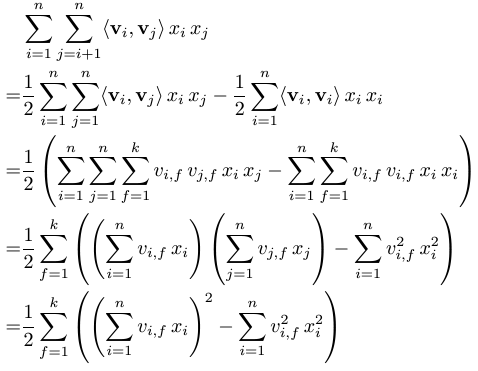</center>

This reformulated term has, as most, $O(kn)$ computation complexity, but with a sparse implementation, summations only need to be computed over non-zero elements, potentially leading to faster implementations (Rendle)

**Updated formula:**

$$
L(x) =
\sum_{x \epsilon T}
[(\alpha + \sum_{i=1}^{n}\beta_{i}x_{i} + 
\frac{1}{2}\sum_{f=1}^{k}
\begin{pmatrix}
\begin{pmatrix}\sum_{i=1}^{n}\gamma_{i,f}x_i\end{pmatrix}^2 -
\sum_{i=1}^{n}\gamma_{i,f}^{2}x_i^2
\end{pmatrix} -
R(x)]^2
+
\lambda_{\beta}
\begin{bmatrix}
\sum_{i=1}^{n}\beta_{i}^{2} 
\end{bmatrix}
+
\lambda_{\gamma}
\begin{bmatrix}
\sum_{i=1}^{n}\sum_{k=1}^{k}\gamma_{i}^{2} 
\end{bmatrix}
$$


For this implementation, I performed coordinate descent to train the parameters with the update equations below. With $A$ being all prediction terms that do NOT include the update variable, the update equations are as follows:

$$
\alpha = 
\frac{1}{|T|} \sum_{(u,i) \epsilon T}
[
R(u,i) -  A
]
$$

$$
\beta_{u} = 
\frac{x_u}{|I_u| + \lambda_{\beta}} \sum_{i \epsilon I_u}
[
R(u,i) -  A
]
$$

$$
\gamma_{u,k} = 
\frac{1}{\sum_{i \epsilon I_u}(\sum_{f, f=/=u}\gamma_{f}^{2}) + \lambda_{\beta}} \sum_{i \epsilon I_u}
\begin{bmatrix}
(
R(u,i) -  A
)
(
\sum_{f, f=/=u}\gamma_{f}
)
\end{bmatrix}
$$

Normally for a coordinate descent algorithm, one parameter is updated at a time - however, when the number of parameters increases, the total training time increases greatly. Notably, in order to update all user parameters, one must iterate over each user's interaction history, and in order to update all item parameters, one must iterate over each item's interaction history. Updating each parameter individually thus involves many redundant cycles. 

To minimize the training time, I implemented a combined coordinate descent algorithm which follow this pattern:

* For each epoch:
  * Update alpha:
  * Update all user biases and user latent vectors
    * For each user, record the relevant user biases and latent vectors
    * For each item in the user's history, record the relevant item biases and latent vectors
    * Update all user biases consecutively
    * Update all latent vectors consecutively
  * Update all item biases and item latent vectors

When the total number of parameters is low, this algorithm takes longer to converge than a more typical coordinate descent algorithm. When the total number of parameters is high, this algorithm achieves convergence in a much shorter amount of time

#### Utilizing Game Genre Data

For this model, I incorporated the typical user/item interaction data as well as user/item OHE representations of genre features. These added features essentially encode how often a given user plays a certain genre, and how often a given item genre is played by a certain user. To analyze the effectivity of including the genre feature, I tested the model's performance when different numbers of the most common genre values were incorporated while keeping all other parameters the same:


```
Number of genres: 1
k = 3
lambda_bias = 1
lambda_gamma = 3

Number of genres: 3
k = 3
lambda_bias = 1
lambda_gamma = 5

Number of genres: 5
k = 5
lambda_bias = 1
lambda_gamma = 3

Number of genres: 21
k = 5
lambda_bias = 1
lambda_gamma = 5
```

|Number of Genres|MSE|MAE|Training Time (s)|Prediction Time (s)|
|-|-|-|-|-|
|1 |4.263|1.576|704.14631|1.446|
|3 |4.252|1.576|1361.23397|2.829|
|5 |4.257|1.573|979.4824 |4.053|
|21|4.253|1.574|2583.45112|6.253|


#### Utilizing Game Tag Data

Similar to the previous model which utilized genre data, I tested using game tag data with a similar approach.


```
Number of tags: 1
k = 3
lambda_bias = 1
lambda_gamma = 3

Number of tags: 3
k = 3
lambda_bias = 1
lambda_gamma = 5

Number of tags: 5
k = 5
lambda_bias = 1
lambda_gamma = 3

Number of tags: 21
k = 5
lambda_bias = 1
lambda_gamma = 5
```

|Number of Tags|MSE|MAE|Training Time (s)|Prediction Time (s)|
|-|-|-|-|-|
|1 |4.255|1.573|1018.71429|1.536|
|3 |4.247|1.574|1361.23397|2.829|
|5 |4.267|1.574|1080.73150|3.846|
|21|4.253|1.576|4314.38606|10.181|


### Global Model Results

|Model|MSE|MAE|Training Time(s)|Prediction Time(s)|
|-|-|-|-|-|
|Basline: Mean|9.18711|2.71691|0.0397|0.004|
|Baseline: Median|9.22322|2.71382|0.0397|0.004|
|CF: Jaccard (User-based)|4.73795|1.68411|1.07|217.265|
|CF: Jaccard (Item-based)|4.86753|1.71192|1.07|338.105|
|CF: Cosine Binary (User-based)|4.74513|1.68625|1.07|192.607|
|CF: Cosine Binary (Item-based)|4.88625|1.71586|1.07|319.863|
|CF: Cosine (User-based)|5.091|1.75482|1.07|834.253|
|CF: Cosine (Item-based)|4.90997|1.71453|1.07|962.648|
|CF: Pearson (User-based)|6.1346027184097785e+29|8635645495796.828|1.07|1016.332|
|CF: Pearson (Item-based)|3.417452448662927e+28|1178071778627.5146|1.07|1044.716|
|CF: Pearson, Upper-Bounded Outputs (User-based)|17.83474|3.00121|1.07|-|
|CF: Pearson, Upper-Bounded Outputs (User-based)|16.64488|2.88379|1.07|-|
|Latent Factor Model|4.25651|1.57026|200.28151|0.33000|
|FM: 1 genre|4.26297|1.57562|704.14631|1.446|
|FM: 3 genres|4.25195|1.57565|1361.23397|2.829|
|FM: 5 genres|4.25671|1.57289|979.4824 |4.053|
|FM: 21 genres|4.25333|1.57381|2583.45112|6.253|
|FM: 1 tag|4.25516|1.57319|1018.71429|1.536|
|FM: 3 tags|4.24724|1.5737|1361.23397|2.829|
|FM: 5 tags|4.26678|1.57428|1080.73150|3.846|
|FM: 21 tags|4.25323|1.57546|4314.38606|10.181|

### Model Results Across Various Bins

The following plots show the MSE and MAE for different percentiles of users and items (based on certain criteria) for different groups of models. For each cluster of plots:

* The top left plot shows the MSE for log-playtime predictions for users based on the number of games that each user owns.
* The top right plot shows the MSE for log-playtime predictions for users based on the fraction of their game library that each user has actually played.
* The lower left plot shows the MSE for log-playtime predictions for games based on the number of users who own each game.
* The lower right plot shows the MSE for log-playtime predictions for games based on the fraction of users who own the game who have actually played the game.

The first plots show the binned results for all models except the Pearson similarity-based collaborative-filtering models. All of those models performed quite poorly compared to the baseline mean/median predictions, so they have been excluded from the plots to avoid skewing the axes. All models saw performance improvements on a user-level as the number of games owned increased, though notably, the matrix factorization methods had the lowest MSE for the lowest percentile grouping. Interestingly, all models saw performance decreases on an item-level as the number of owners increased. Every non-baseline model had the lowest MSE in the middle of the range, though the matrix factorization models had the minima around 10-15 games owned while the collaborative filtering models had the minima around 22-200 games owned.

The trend for both user-level and item-level analysis based on playership vs ownership was very similar where the baselines started with high MSE, dropped slightly, then increased again. Most other models had the opposite trend where they started low, rose until they hit a maximum, then dropped again slightly. This time, each model had a very similar MSE curve. The baselines also performed worse on the user-level than on the item-level. On the item-levels, the baselines actually came fairly close to outperforming some of the collaborative filtering methods.

Every other model outperformed the baselines for each percentile group, but the collaborative filtering methods performed significantly worse for the lower percentile groups for both users and owners. Additionally, the plots reveal that the collaborative filtering methods all performed worse than every matrix factorization method across all percentile groupings.

<br>
<center>
    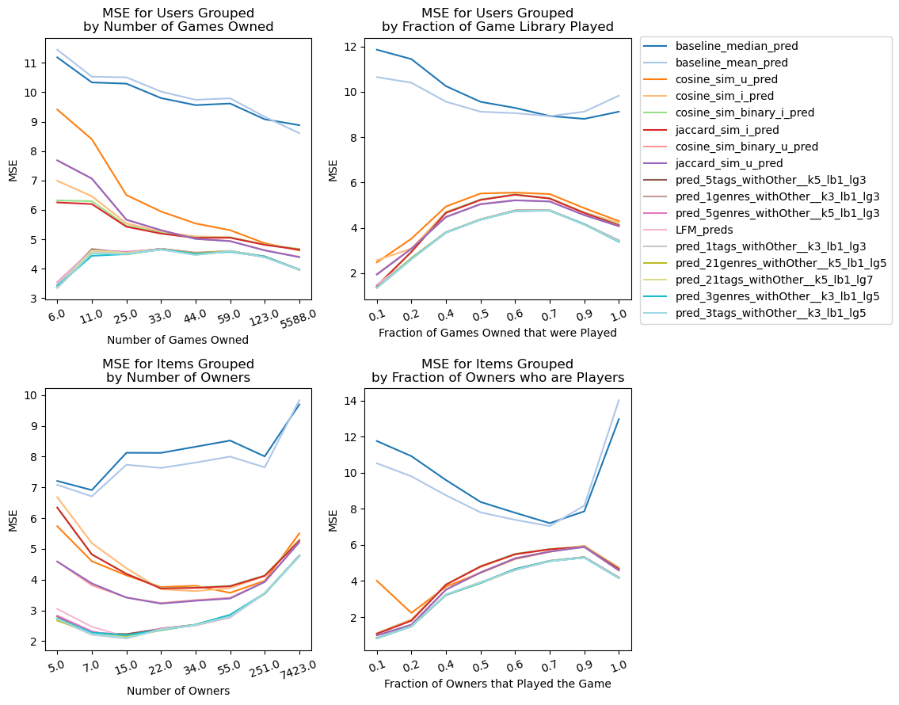
</center>
<br>

The latent factor model generally had similar performance to the factorization machines based on genre data, though the performance deviates quite significantly at the lower percentiles on both the user and item-levels.. On the item-level analysis, every factorization machine utilizing genre outperformed the regular latent factor model for items with fewer than 15 owners. On the user-level analysis, there was quite a bit more variation across the entire range.

<br>
<center>
    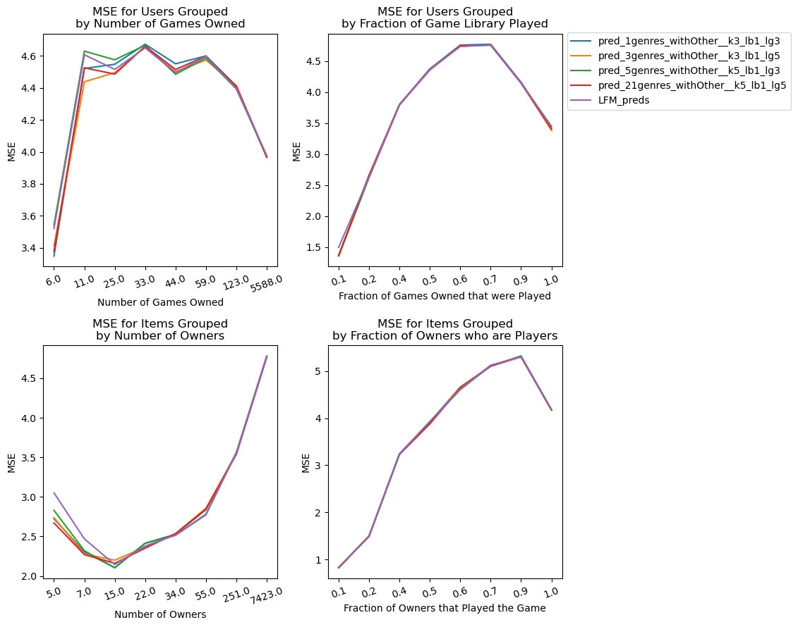
</center>
<br>

The trend is fairly similarly for the factorization machines based on tags with every model outperforming the latent factor model at the low percentiles on the item-level analysis. However, only the model utilizing 3 tags appeared to clearly outperform the latent factor model at the low percentiles on the user-level analysis.

<br>
<center>
    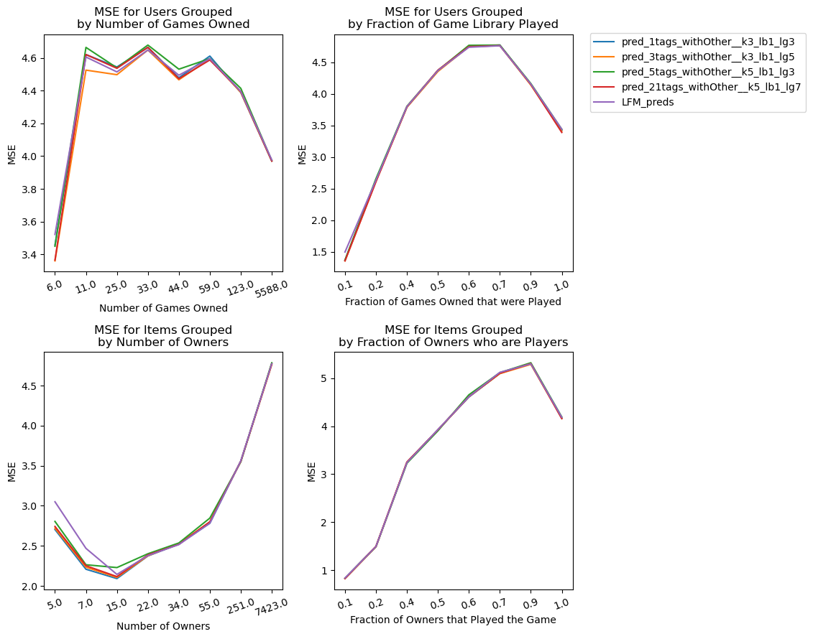
</center>
<br>


# Analysis

All models tested significantly outperformed the baselines of simply predicting the mean or the median with the exception of the Pearson similarity-based collaborative filtering models, though each came with its own drawbacks.

#### Memory-Based Collaborative Filtering

Though one of the simpler model classes, the models utilizing the Jaccard similarity and binary cosine similarity functions performed decently well. On the other hand, the numeric similarity functions performed quite poorly, especially the model utilizing the Pearson similarity function. This is likely due to the large discrepancies in playtime values between different games and users. Additionally, the numeric cosine similarity and Pearson correlation similarity functions assume that the target values align with the user/item preferences, but that might not necessarily be true for video game playtimes. While some games are quite short, others are extremely long, with some games technically not having an "ending," such as live-service games like Genshin Impact and MMORPGs like Runescape and World of Warcraft.

Additionally, the numeric similarity functions required significantly longer training times than the binary variations, even after limiting the number of interactions to include in the similarity calculations. If the algorithm considered all possible interactions, the MSE/MAE may lower, but at a massive cost in computational requirements as certain users and items had thousands of recorded interactions in this dataset.

One final consideration is that some of the collaborative filtering models required a long training time to calculate similarity values. If the training data were to be updated, then the model must be trained again, so these models are quite inefficient for situations requiring live model updates.

#### Latent Factor Model (LFM) vs Factorization Machine (FM)

The LFM and the FM had very similar performance, especially in regard to minimizing the MSE, though when tuned properly, the FM outcompetes the LFM However, this increase in performance comes at a great training time cost due to the large number of computations required to update exponentially more parameters. The latent factor model without any additional features converged to a great solution in just 200 seconds while the fastest FM model which utilized a single genre feature took just over 700 seconds. Additionally, in order to maximize the potential of the FM, the hyperparameters need to be tuned, and the included features need to be carefully selected. With my choice of OHE genre and tag columbn, there was some slight performance improvements in overall MSE and some noticeable improvements in the MSE for users and items with fewer interactions. However, the LFM had incredible performance in comparison, and in fact, the LFM had an almost identical curve to most of the FMs for most user/item percentile groupings. This implies that, while adding more information to the models helped increase performance for the users/items with fewer interactions, this information was not necessary to achieve good performance overall, and so these models may be overly complex for the task.

#### Performance Across Bins of Items and Users.

Overall, every model tested outperformed the baselines for each subgroup of user and item. The LFM and FM models both generally outperformed every other model, especially at the lower end of the interaction spectrum where not enough data is known to make meaningful predictions. This makes these models quite effective at solving the cold start problem.

#### Exploring Playtime as the Predicted Variable

Another interesting trend is that while every model generally improved when more interactions were incorporated into the model, there is a notable drop in performance across every model except the baselines when the rate of playership to ownership is in the middle of the range (especially in the 0.7-0.9 range). This could be due to a few reasons. When a user plays more games, the model has more information to consider what kinds of games the user plays - however, there could be a lot of noise in this data. Just because a user has played a game, doesn't necessarily mean that the user will play other games like it. It's also worth noting once again that games have very different lengths which lead to inconsistent playtime predictions. A more accurate measure might be the percentage of a game completed, but that cannot be extracted from this dataset.

# Conclusion

Overall, while every model outperformed the baselines, the LFM had the best overall performance for this dataset. It is fast, flexible, and highly scalable. The factorization machine is a close second - it has the most potential to become extremely accurate, but at a great time and computational cost. It also requires a lot of hyperparameter tuning to achieve the best results

### Possible Improvements

The factorization machine, though in a fairly optimized state, was likely not utilized to its fullest potential. For one, it would be worth testing a more typical gradient descent optimization algorithm, especially when the number of parameter updates increases. Much of the training time is spent on iterating through the dataset, so cutting down on redundant iterations could achieve better performance. It would also be interesting to see whether clusters of feature values could be more useful than the feature values themselves. There is a lot of overlap between different genres and tags, but utilizing more features increases the computational costs greatly. By combining features into a reduced representation, one could potentially incorporate much more information into the model.

### Citations

**Self-attentive sequential recommendation**<br>
Wang-Cheng Kang, Julian McAuley<br>
*ICDM, 2018*

**Item recommendation on monotonic behavior chains**<br>
Mengting Wan, Julian McAuley<br>
*RecSys, 2018*

**Generating and personalizing bundle recommendations on Steam**<br>
Apurva Pathak, Kshitiz Gupta, Julian McAuley<br>
*SIGIR, 2017*

S. Rendle, "Factorization Machines," 2010 IEEE International Conference on Data Mining, Sydney, NSW, Australia, 2010, pp. 995-1000, doi: 10.1109/ICDM.2010.127. keywords: {Mathematical model;Support vector machines;Frequency modulation;Predictive models;Data models;Equations;Computational modeling;factorization machine;sparse data;tensor factorization;support vector machine}

Suvash Sedhain, Aditya Krishna Menon, Scott Sanner, and Lexing Xie. 2015. AutoRec: Autoencoders Meet Collaborative Filtering. In Proceedings of the 24th International Conference on World Wide Web (WWW '15 Companion). Association for Computing Machinery, New York, NY, USA, 111–112. https://doi.org/10.1145/2740908.2742726

